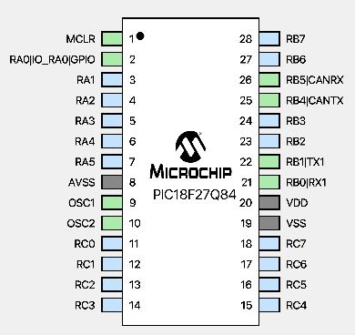

# Microcontroller CANBUS Base

This repository holds base code used to create a CANBUS network using
PIC MCUs. This specific repo is designed to be used with the PIC18F27Q84.

## Usage

To use this code, clone it to a local folder and rename it to `can-base.X`, open
folder in MPLABX and ensure that the project can compile successfully.

## Microcontroller Setup

PIC18F27Q84 setup:

## Contributing

Pull requests are welcome. For major changes, please open an issue first to discuss what you would like to change.

Please make sure to update/add tests as appropriate.

## License

Please see the [license](https://github.com/relectric-car-team/canbus-mcu-test/blob/main/LICENSE) for licensing information
